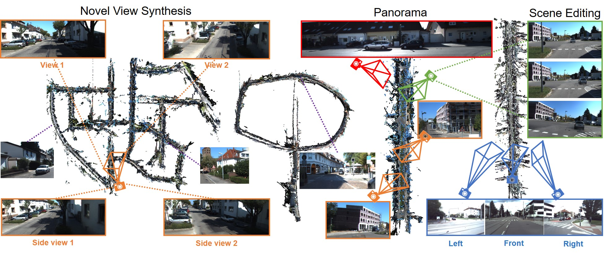
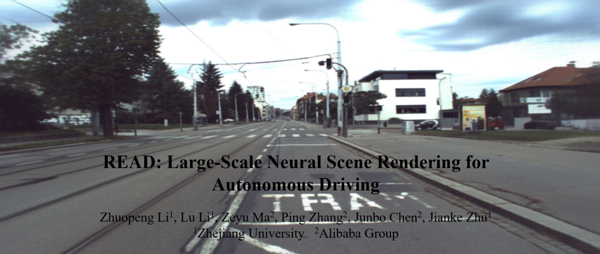
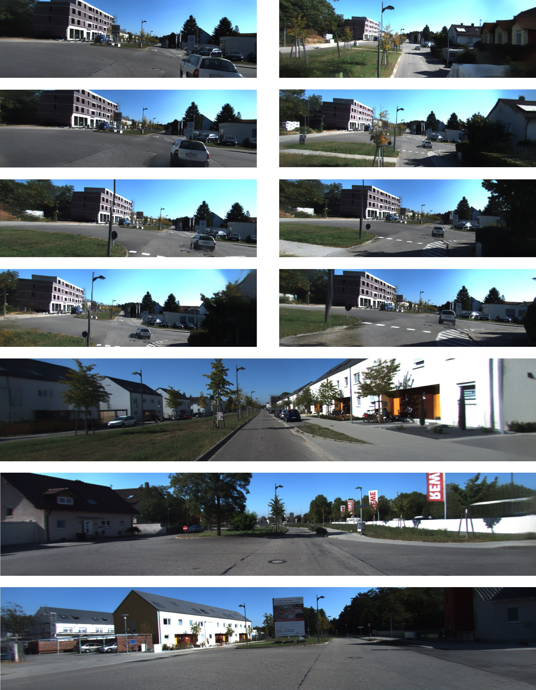
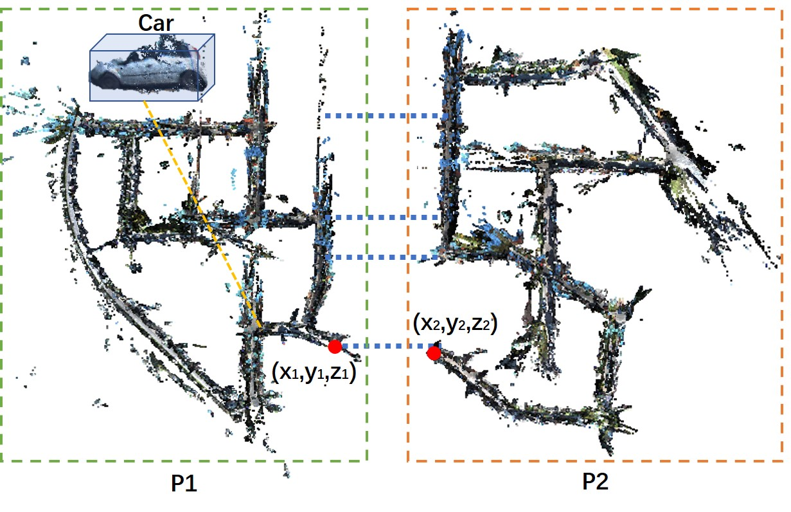
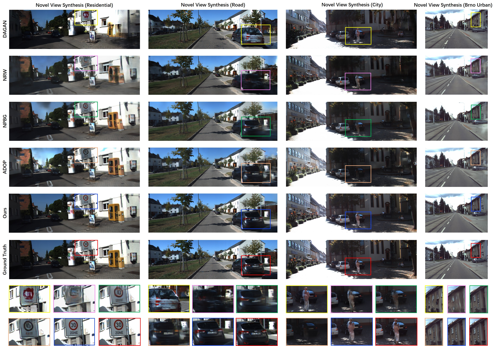

# READ-Large-Scale-Neural-Scene-Rendering-for-Autonomous-Driving
implementation of "READ:  Large-Scale Neural Scene Rendering for Autonomous Driving"

Paper: https://arxiv.org/abs/2205.05509

Compressed video: https://www.youtube.com/watch?v=73zcrqwNFRk

## Citation

```
@misc{https://doi.org/10.48550/arxiv.2205.05509,
  doi = {10.48550/ARXIV.2205.05509},
  url = {https://arxiv.org/abs/2205.05509},  
  author = {Li, Zhuopeng and Li, Lu and Ma, Zeyu and Zhang, Ping and Chen, Junbo and Zhu, Jianke},  
  title = {READ: Large-Scale Neural Scene Rendering for Autonomous Driving},  
  publisher = {arXiv},  
  year = {2022},  
  copyright = {arXiv.org perpetual, non-exclusive license}
}
```


## Overview: 




<!--- 
# [](https://youtu.be/kC-bwky4e7Q)
[](https://youtu.be/73zcrqwNFRk)
--> 


## Novel View(Click to view the video):

[](https://youtu.be/73zcrqwNFRk)

##  Scene Editing:

We can move and remove the cars in different views. A panorama with larger view can be synthesized by changing the camera parameters.



## Scene Stitching:

Our model is able to synthesize the larger driving scenes and update local areas with obvious changes in road conditions. 


## Novel View Synthesis:



