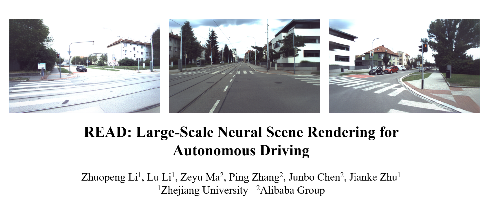
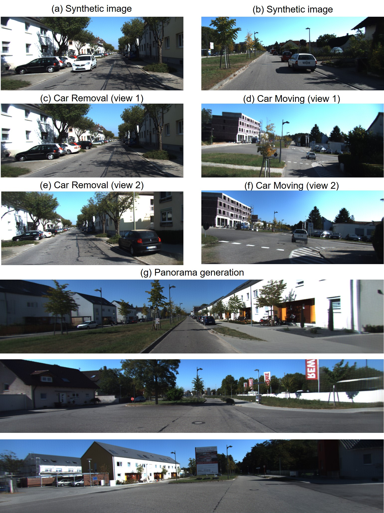

# READ: Large-Scale Neural Scene Rendering for Autonomous Driving


Paper: https://arxiv.org/abs/2205.05509 (Old version)
 <!--- 
Video: 
 [Bilibili](https://www.bilibili.com/video/BV1KY411w7qh/)  [Youtube](https://youtu.be/W3h5nmmM5BM)  

 [(Compressed)](https://youtu.be/73zcrqwNFRk)
-->


Demo: (Use only one camera view for training)


<p float="left">


</p>

<p float="center">
  
   
</p>


## Overview: 

This is the code release for our AAAI2023 paper, PyTorch implementation of Large-Scale Neural Scene Rendering for Autonomous Driving(READ), a large-scale neural rendering method is proposed to synthesize the autonomous driving scene~(READ), which makes it possible to synthesize large-scale driving scenarios on a PC. Our model can not only synthesize realistic driving scenes but also stitch and edit driving scenes.


## Setup

The following instructions describe installation of conda environment.  Please refer to [requirement](https://github.com/JOP-Lee/READ/blob/main/requirement.sh)
If you want to set it to headless mode(without X server enabled), see the MyRender in the [src folder](https://github.com/JOP-Lee/READ/tree/main/src). 

Run this command to install python environment:
```bash
cd src/MyRender
pip install -v -e .  
```


## Run

You can render one of the fitted scenes we provide right away in the real-time viewer or fit your own scene.

Download fitted scenes and universal rendering network weights from [here](https://zenodo.org/record/7395608#.Y4xv9HZBxPY) and unpack in the Data directory.

We suppose that you have at least one GeForce GTX 1080 Ti for fitting and inference.


### Use fitted scene

Here we show an example how to run fitted scenes in the viewer.

#### kitti6
```bash
python viewer.py --config downloads/kitti6.yaml
```

### Viewer navigation:

* Move forward: w 
* Move backward: s
* Move left: a 
* Move right: d
* Rise: q
* Fall: e
* Turn to the left: 1
* Turn to the right: 2
* Turn to the up: 3
* Turn to the down: 4


## Train

python train.py --config configs/train_example.yaml --pipeline READ.pipelines.ogl.TexturePipeline --crop_size 256x256

The size of crop_size depends on your GPU memory, and the parameter train_dataset_args can be adjusted in the configs folder


<!--- 
# [](https://youtu.be/kC-bwky4e7Q)
[](https://youtu.be/73zcrqwNFRk)


## Novel View(Click to view the video):

[](https://youtu.be/W3h5nmmM5BM )
--> 


##  Scene Editing:

READ can move and remove the cars in different views. A panorama with larger view can be synthesized by changing the camera parameters.

 

## Scene Stitching:

READ is able to synthesize the larger driving scenes and update local areas with obvious changes in road conditions. 


## Novel View Synthesis:


## Acknowledgments
In this code we refer to the following implementations: [npbg](https://github.com/alievk/npbg) and [
MIMO](https://github.com/chosj95/MIMO-UNet). Great thanks to them! 


## Citation
If our work or code helps you, please consider to cite our paper. Thank you!
```BibTeX
@inproceedings{li2022read,
  author = {Li, Zhuopeng and Li, Lu and Zhu, Jianke*},
  title = {READ: Large-Scale Neural Scene Rendering for Autonomous Driving},
  booktitle = {AAAI},
  year = {2023}
}
```

